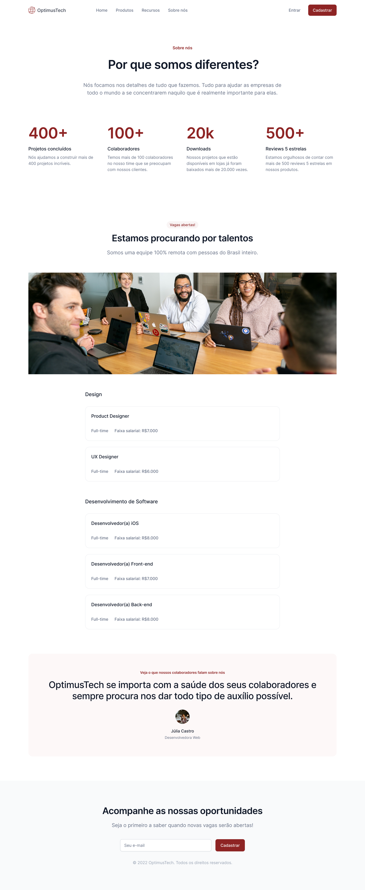

<h1 align="center"> OptimusTech </h1>

OptimusTech - site de contratação 

  

 

## 🚀 Tecnologias

Esse projeto foi desenvolvido com as seguintes tecnologias:

- HTML e CSS
- Git e Github
- Figma

## 💻 Projeto

OptimusTech é uma projeto de umas das paginas do site, a de vagas. O figma disponivel pela Alura no desafio de 7 dias para por em pratica os conhecimentos adiquiridos de HTML e CSS 
Não tem as telas no figma, mas o site foi desenvolvido com o conceito Mobile-first, para que o usuario tem acesso em todos os dispositivos.

- [Visite o projeto online](https://mathfrlima.github.io/Alura-7daycode-OptimusTech/)

## 🔖 Layout

Você pode visualizar o layout do projeto através [DESSE LINK](https://www.figma.com/file/mm3MLozvUDGhDRTxSLlGL5/7daysOfCode-HTML-CSS?node-id=0%3A1&t=pKSDav1hsDU2spF3-0). É necessário ter conta no [Figma](https://figma.com) para acessá-lo.
